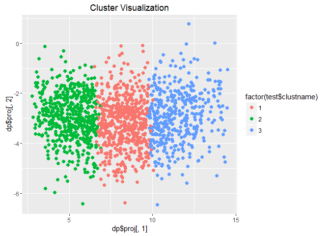
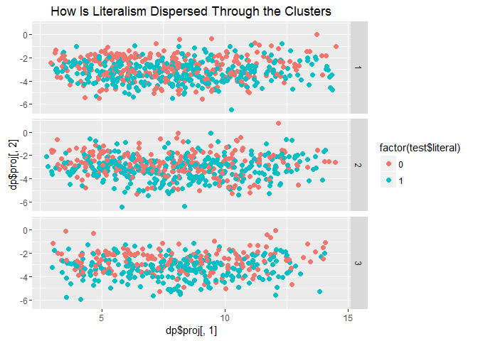

    library(ggplot2)
    library(foreign)
    library(car)
    library(dplyr)
    library(rpart)
    library(fpc)
    library(ggplot2)
    library(Rmisc)
    library(extrafont)
    library(extrafontdb)

Are evangelicals are a monolith?
================================

A lot of outsiders have begun to wonder if evangelicals are truly a
monolithic bloc or are there some cracks beginning to form in what we
believe an evangelical to be. I wanted to take a look at that by using a
technique that is helps to sort a group into similar cases, also known
as a cluster. These clusters are created using an algorithm and will
help to divide evangelicals up into camps.

Data Cleaning
-------------

    gss <- read.dta("D:/reltrad.dta", convert.factors = FALSE)
    gss <- subset(gss, year >= 2010)
    evan <-subset(gss, evangelical == 1)

The first thing I have done is used the RELTRAD coding scheme employed
by Steensland et al (2000) to create a unified measure of
evangelicalism. Here is a link to my github with that syntax for both
[Stata and R:](https://github.com/ryanburge/reltrad). In addition I am
just using data from the General Social Survey from 2010 to 2014. That
is the three most recent waves of the GSS. The subgroup of evangelicals
is sufficiently large (about 1500). I am going to do a bunch of cleaning
behind the scenes now to get the data in a usable format. To see the
full coding and cleaning syntax I have posted it
[here.](https://github.com/ryanburge/clustering/blob/master/datacleaning)

I'm going to create a dataframe to just do the clustering, called test.
Here's the variables that are included.

    test <- select(evan, age, literal, attnd, male, tolerance, abortion, gaymarriage, gaysex, repubid, welfare, military, environment, drugs, educ)

I can't have any missing data for the clustering to work properly. I
have a handful of cases where age is missing, as well as education. I am
going to use some prediction modeling to make a guess at both the age
and education for the missing values.

    age_fit <- rpart(age ~ educ + attnd + male + tolerance + abortion + gaymarriage + gaysex + repubid + welfare + military + environment + drugs, data = test[!is.na(test$age), ],
    method = 'anova')
    test$age[is.na(test$age)] <- predict(age_fit, test[is.na(test$age), ])

    educ_fit <- rpart(educ ~ age + attnd + male + tolerance + abortion + gaymarriage + gaysex + repubid + welfare + military + environment + drugs, data = test[!is.na(test$age), ],
    method = 'anova')
    test$educ[is.na(test$educ)] <- predict(educ_fit, test[is.na(test$educ), ])

Clustering
----------

Now, it's time to run the clustering. But how many clusters should I
use?

    set.seed(555)
    wss <- (nrow(test)-1)*sum(apply(test,2,var))
    for (i in 2:15) wss[i] <- sum(kmeans(test,
                                         centers=i,iter.max=1000,algorithm="MacQueen")$withinss)

    plot(1:15, wss, type="b", xlab="Number of Clusters",
         ylab="Within groups sum of squares")

  
 Using the graph it becomes apparent that the jump from 2 to 3 clusters
still gives us a good deal of utility, but that moving to four clusters
gives us a lot less. Let's stick to three.

    k<-kmeans(test, centers=3,iter.max=1000,algorithm="MacQueen")
    k$size

    ## [1] 597 557 418

    k$centers

    ##        age   literal     attnd      male tolerance  abortion gaymarriage
    ## 1 51.70015 0.5979899 0.6155779 0.4237856 0.4108319 0.1825796  0.06365159
    ## 2 31.68223 0.5385996 0.6429533 0.3788151 0.4240575 0.1579892  0.09694794
    ## 3 71.72727 0.6028708 0.6420455 0.4043062 0.3360447 0.1315789  0.03588517
    ##       gaysex  repubid   welfare  military environment     drugs     educ
    ## 1 0.11055276 4.216080 0.4003350 0.2881072   0.3763261 0.4103853 13.10720
    ## 2 0.15978456 4.168761 0.3776182 0.2998205   0.3997606 0.4111311 13.39677
    ## 3 0.07655502 4.270335 0.3915470 0.2838915   0.3197767 0.3979266 12.47060

So, we have three decently sized centers. That's one of the advantages
of MacQueen clustering. And we can see that the clusters have broken
down really nicely into three age brackets with one clustere having the
average age of 32, another having the average age of 53, and the third
cluster is 73. Let's visualize those.

    dp = discrproj(test, k$cluster)
    test$clustname<-k$cluster
    test$clustname<-factor(test$clustname)
    ggplot(test, aes(dp$proj[,1], dp$proj[,2], color=factor(test$clustname)))+geom_point(pch=19,size=2)+ggtitle("Cluster Visualization")

  

    ggplot(test, aes(dp$proj[,1], dp$proj[,2], color=factor(test$literal)))+geom_point(pch=19,size=2)+facet_grid(clustname~.)+ggtitle("How Is Literalism Dispersed Through the Clusters")

  
 These visuals do look really nice, but because I am clustering on so
many factors a two dimensional plot doesn't really convey how the
clusters actually look. We can tell that they are logically distributed
across the x axis, however.

Results
-------

Let's start visualizing our results. I want to be able to tell two
things.

1.  Are evangelicals alike? Do each of the three clusters have the same
    opinions on government? Church attendance? The Bible?
2.  How different are evangelicals than the general population?

**Here's how to read the charts. A dot represents the mean for each
group. The lines extending out each side of the dot are the 95%
confidence intervals. If the lines for a cluster overlap the lines for
another cluster then we cannot say that they have statistically
different opinions on the subject.**

**The vertical dashed line you will see in the following graphs
represents the mean of the entire GSS sample, not just evangelicals.**

### Religious Behavior

Let's take a look at two religious behaviors. Believing in a literal
Bible and church attendance.

  
 There are no surprises here. Evangelicals are much more likely to
believe in a literal Bible and although the youngest cluster in the
analysis is less likely to belive that the Bible is literally true, each
of the clusters is not statistically distinct. The same is true of
church attendance. No matter the age, evangelicals attend church at
basically the same rate. Which is much more frequently than the general
populace.

### Tolerance

  
 Now this is an intersting finding. The three clusters are distinct in
the area of political tolerance. The older cluster is statistically less
tolerant than the other two. Even more interesting is that the youngest
cluster of evangelicals is not statistically more or less tolerant than
the overall sample in the GSS. Maybe there are some differences forming
here.

### Social Issues

  
 On the issue of abortion, evangelicals are united and distinct from the
average American. The mean of no cluster is higher than 18% in favor of
abortion under any circumstance. On the issue of gay marriage a similar
pattern emerges. Evangeilcals are opposed to gay marriage and are far
away from the average American. However, there is a small (but
important) distinction on the issue of homosexual sex. The youngest
cluster is more likely to say that homosexual is "not wrong at all" and
this is statistically distinct from both other clusters.

### Party Affiliation

  
According to these findings, evangelicals are pretty cohesive on their
party affiliation. None of the clusters are ideologically distinct.
However, they is a great distance between evangelical's ideology and
everyone else's. According to these findings an evangelical is 10% more
Republican than the average American.

### Spending Issues

  
 A few interesting things here. On the issue of welfare spending the
middle cluster (those in their 50s) are more likely to favor spending on
welfare programs than both the other two clusters and the general
population. That's an unusual finding. In regard to the environment, the
older cluster (those in their 70's) are less likely to support spending
federal money but the other two clusters have an opinion on environment
funding that is not different than the general population. On drug
programs evangelicals all look alike and are no different than the
general population.

Concluding Thoughts
-------------------

So, are evangelicals a monolith? On matters of religiosity the answer is
clearly yes. They attend church frequently and they have a very high
view of the bible, which makes them distinct from the general
population. Younger evangelicals are as tolerant as the average American
while middle aged and older evangelicals are not. On social issues the
younger set is showing signs of moving toward the center on issues of
homosexuality but on abortion, evangelicals are in lock step. Which is
also true in regard to political party affiliation. on taxing and
spending older evangelicals oppose spending to the greatest degree but
there are more moderate views among the other two groups on spending on
the environment.

In fact, evangelicals are distinct and different than the general
population but have achieved a remarkable amount of internal coherence.

I had to supress a lot of syntax to make this more readable. For full
coding syntax visit my [Github
page](https://github.com/ryanburge/clustering)
